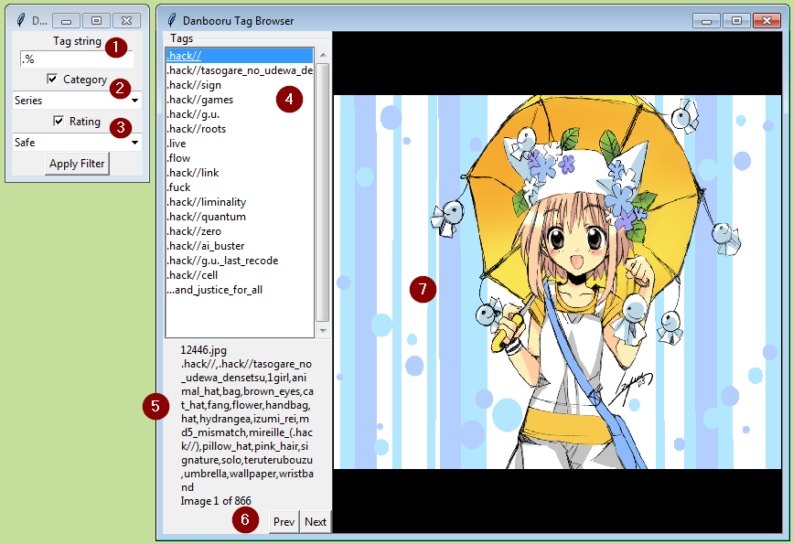

A "browser" for viewing images associated with tags.

```diff
-NOTE: the database and feature set is in flux right now (February 2020) as I update to the 2019 dataset.
```
The set of images to view can be searched / filtered in two ways:
1. Selecting a single tag from a list of tags. The list of tags may be searched with wildcards and by category.
2. Using boolean query (AND, NOT, OR) to find images which match a combination of tags.

When a set of images has been specified, the first image (and details) is shown. You may then cycle through all
the images in the set.

The browser is a simple Tkinter interface and may be run on any platform with Python 3 installed. Uses the sqlite 
database as defined by the database project in this repository.

To use:
1. The program assumes the database (`danbooru2018.py`) is in the application folder.
2. Edit the `IMAGES_BASE` value in `tagview.py` to the path of the image set (e.g. `G:\danbooru2018\original`).
3. Execute `python tagview.py`

### Screen Cap as of 20200118



In the above screencap, the current image set is the 26,897 images with the tag `maid` that do _not_ have the tag `touhou`. Also, 
the tag list window has been filtered to show all tags which start with the string `maid`.

1. Shows the current image in the image set. The image is currently sized to the view area, preserving aspect ratio.
2. Shows tags and other details about the current image.
3. The count and position of the current image in the image set.
4. Buttons to navigate within the image set. The PageUp, PageDn and Home keys are handled as well.
5. Mark the current image as "hidden" in the database. "Hiding" an image will prevent it from appearing in future sets.
6. The filter window. This entry allows you to filter by the tag name. Wildcards are currently
   using database syntax (i.e. '%' is wildcard, not '*').
7. This entry allows you to filter tags by their Danbooru category (artist, character, etc).
8. The list of filtered tags to select from. Click the 'Apply' button to filter by name and category. Selecting a tag
   from this list will change the image set to those images with the selected tag.
9. The advanced search tag window. Up to four clauses may be applied. Clauses may be `AND`, `AND NOT`, `OR`, `OR NOT`.
   In the screenshot above, the full clause is `maid AND NOT touhou`. Wildcards are allowed. E.g. to find images which match 
   `maid` and are part of the `fate` series, you'd use `maid and fate%`.
10. This entry allows you to filter images by their rating.
11. Use this button to update the image set with your query and rating.
12. Use this button to reset the query to empty.

Annotation courtesy of [Greenshot](https://getgreenshot.org/).

#### TODO (as of 20200118):
- view more than the first 100 tags
- full-size scrollable image view (when image is very large)
- ability to generate a file containing the paths to all images in the current set
- animate GIF and APNG
- ability to add / remove more boolean clauses
- querying with boolean clauses can be quite slow. Do something to improve perceived performance.
- add ability to create "favorite" groups and mark an image as such (i.e. personal pools).
- change "Delete" to "Hide"
- add ability to include "hidden" images in the image set
- tweak the 'look' of controls (e.g. add padding)
