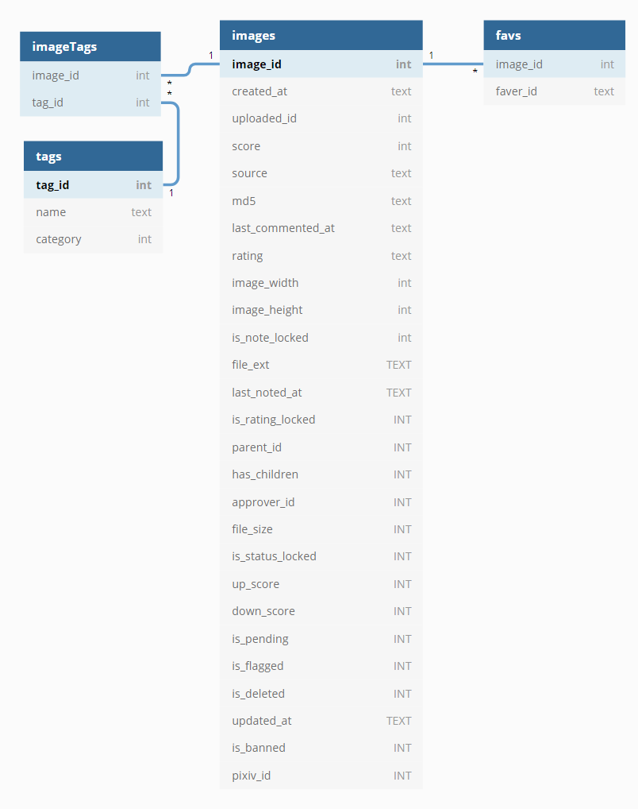

NOTE: the database is in flux right now (January 2020) as I update to the 2019 dataset.

### makedb.py

A script to create a sqlite database from the Danbooru2018 metadata files.

**WARNING** : the full database is about **7.5G** in size!

Inspired by:
https://github.com/jxu/danbooru2018-metadata/blob/master/read_json.py

with the following important differences:

- The image <> tag relation is normalized, with a "crosswalk" table 
   mapping the one-to-many relationship between an image and tags.
- Indices have been created to optimize common queries.
- The "pools" metadata is not stored in the database. The "pools" data
   has been stored in an odd fashion which I've not yet determined how
   to parse.
- A new column, `user_delete` has been added to the `images` table. This
   column is used to mark an image as "hidden" without actually deleting
   the database row. Currently, the values are:
   ```
   0 : not hidden
   1 : marked as hidden by the user
   2 : no matching file in the file set
   3 : this is a duplicate image (contents exactly match another image in the file set)
   4 : this is a duplicate image (image "effectively" matches another image in the file set).
       i.e. different only by size and/or quality level.
   ```
### dbquery.py

A helper utility to allow ad-hoc queries against the database. Stolen from
the Python docs and tweaked.

### check_exists.py

A helper script to find discrepancies between the fileset and the metadata.
Namely, there are some images in the metadata which don't have any matching
file. Marks metadata rows with missing images as `user_delete=2` (see above).

### The Schema


